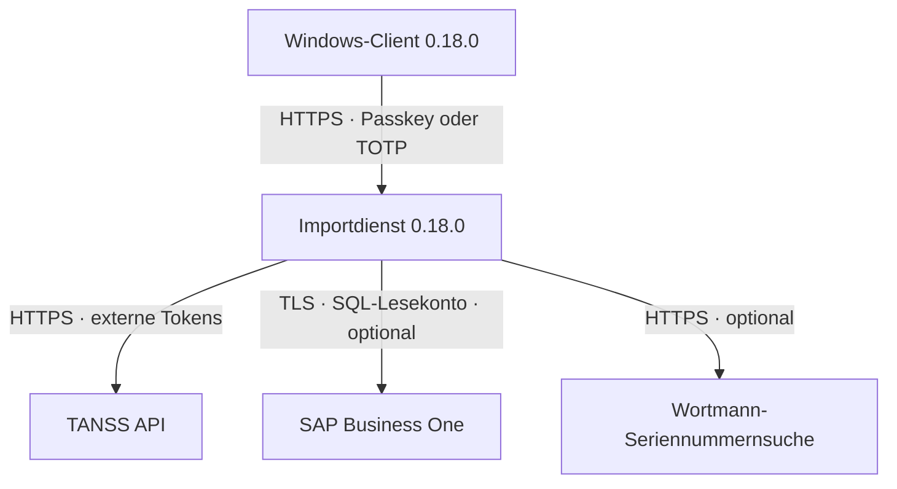
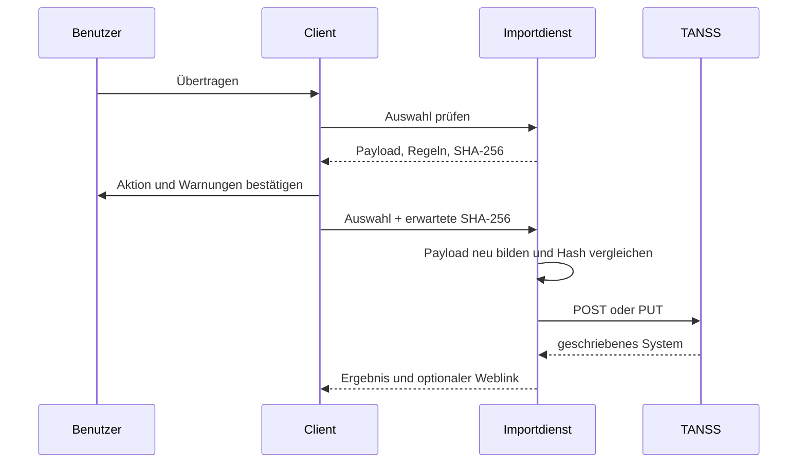

# Technische Dokumentation – TANSS Device Import

**Release:** Client 0.18.0 / Importdienst 0.18.0  
**Laufzeiten:** .NET 10, WPF unter Windows, ASP.NET Core unter Linux/Docker

## 1. Zweck und Systemgrenze

Der Windows-Client erfasst lokale Systeminformationen, lässt einen Benutzer die
zu übertragenden Felder auswählen und sendet die Auswahl an einen getrennten
Importdienst. Nur der Importdienst kennt die TANSS-Tokens und optionale
SAP-Zugangsdaten. Der Client spricht TANSS oder SAP nie direkt an.

Das Repository enthält absichtlich keine konkrete Betreiber-Domain, IP-Adresse,
Datenbankbezeichnung, Kundenkennung oder Zertifikat-Fingerabdruck.

## 2. Clientstart und Serveradresse

Der Client besitzt keine Standard- oder Fallback-Adresse. Beim Start muss der
Benutzer eine absolute HTTPS-Adresse des Importdienstes eingeben. Die Prüfung
verwirft:

- andere Schemas als `https`,
- relative Adressen,
- Adressen ohne Host,
- eingebettete Benutzerinformationen,
- Query-Strings und Fragmente.

Ein abschließender Schrägstrich wird normalisiert. Die Adresse verbleibt nur im
Arbeitsspeicher und wird weder in einer Datei noch in der Registry gespeichert.
Bei einem Kundenwechsel innerhalb derselben Sitzung wird sie zur bequemeren
Weiterarbeit vorausgefüllt.

## 3. Authentifizierung

### 3.1 Passkey (FIDO2-Hardware-Schlüssel)

Die Benutzeroberfläche verwendet die markenneutrale Bezeichnung
**Passkey (FIDO2-Hardware-Schlüssel)**. Zugelassen werden externe
Cross-Platform-Authentifikatoren. Die WebAuthn-Anfrage setzt User Verification
auf `discouraged`, sodass die vorgesehene Bedienung nur das Einstecken und die
Berührung verlangt. Ob ein konkreter Authentifikator oder eine Plattform aus
eigenen Richtlinien dennoch eine PIN verlangt, liegt außerhalb der Anwendung.

Die Registrierung benötigt einen kurzlebigen, einmalig verwendbaren
Administrationscode. Gespeichert werden ausschließlich öffentliche
Credential-Daten, Bezeichnung, Zeitstempel und Signaturzähler. Private Schlüssel
verlassen den Authentifikator nicht.

### 3.2 TOTP

TOTP folgt RFC 6238 mit HMAC-SHA1, sechs Stellen und 30-Sekunden-Schritten. Der
Server akzeptiert ±1 Zeitfenster, verhindert Wiederverwendung durch einen
monotonen Zähler, vergleicht konstantzeitig und begrenzt Anmeldeversuche pro IP.
Sitzungstokens werden zufällig erzeugt und nur als SHA-256-Hash im Speicher
gehalten.

### 3.3 Entfernte Clientzertifikate

Version 0.18.0 unterstützt keine mTLS-/Clientzertifikat-Anmeldung mehr. Im
Client existiert weder eine Zertifikatsauswahl noch ein Fingerabdruck; der Server
fordert und validiert keine Clientzertifikate. TLS bleibt für den Transport
verpflichtend.

## 4. Erfassung und Feldzuordnung

Der Client kann unter anderem folgende Daten ermitteln oder übernehmen:

| Quelle | TANSS-Ziel |
|---|---|
| Kunde | `companyId` |
| Hostname | `name` |
| Modell | `model` |
| Hersteller | `manufacturerId` |
| Betriebssystem | `osId` |
| SAP-Artikelnummer | `articleNumber` |
| Wortmann-Geräteartikelnummer | `manufacturerNumber` |
| Seriennummer | `serialNumber` |
| TeamViewer-ID | `teamviewerId` |
| Serverkennzeichnung | `server` |
| VM-Host | `hostId` |
| Kauf- und Garantiedaten | `date`, `guarantee.*` |
| Netzwerkadapter | `ips[]` |

`billingNumber` wird für die SAP-Artikelnummer ausdrücklich nicht verwendet.

## 5. Direkter Schreibablauf und optionale Vorschau

Die sichtbare Hauptaktion lautet **System nach TANSS übertragen**. Sie führt
technisch weiterhin einen zweistufigen Sicherheitsablauf aus:

Damit wird die JSON-Ansicht optional, nicht aber die Integritätsprüfung. Der
eingeklappte Bereich kann jederzeit manuell geöffnet und mit
**Optionale Vorschau erstellen** aktualisiert werden. Er zeigt Feldzuordnung,
Zieloperation, Hinweise, Blockierungen und die geplante JSON-Nutzlast.

Kann der Server nicht schreiben, öffnet der Client diesen Bereich automatisch,
zeigt alle Gründe an und markiert zuordenbare Felder rot. Nach jeder Feldänderung
wird die intern bestätigte Vorschau verworfen und beim nächsten Schreibversuch
neu berechnet.

## 6. Bestehende Systeme und Dubletten

Treffer nach Seriennummer werden unternehmensweit geprüft. Ein eindeutiger,
aktiver Treffer beim gewählten Kunden kann ergänzt oder mit den ausgewählten
Werten überschrieben werden. Treffer eines anderen Kunden und mehrdeutige aktive
Treffer blockieren den Vorgang.

Historische, inaktive Vorgängersysteme mit gleichem Hostnamen blockieren eine
eindeutige Aktualisierung nicht. Aktive oder nicht eindeutig als inaktiv
erkennbare Dubletten bleiben blockierend. Der Server entscheidet; der Client
wählt bei mehrdeutigen Treffern niemals selbst ein Ziel.

## 7. Wortmann-Garantiedaten

Die Seriennummer wird serverseitig an die offizielle Suche übertragen. Neben
Beginn, Ende, Servicecode und Beschreibung wird die tatsächliche Geräteposition
als `manufacturerNumber` übernommen. Gebühren-, Montage- und Servicepositionen
werden nicht als Geräteartikel verwendet. Ist das Ergebnis mehrdeutig, erfolgt
keine automatische Übernahme.

Die Funktion basiert auf dem HTML-Aufbau der externen Seite und kann durch
Änderungen des Anbieters beeinträchtigt werden. Eingaben und ausgewertete Werte
sind begrenzt und validiert.

## 8. SAP Business One

Der optionale Endpunkt `/api/v1/sap/items/by-serial` fragt `dbo.OSRN`
parametrisiert nach `DistNumber` ab und liefert eindeutige `ItemCode`-Werte. Der
SQL-Befehl enthält keine Stringverkettung mit Benutzereingaben. Kein, ein oder
mehrere Treffer werden getrennt behandelt; mehrere Treffer erfordern eine
Benutzerauswahl.

Die Konfiguration nennt Datenbank und SQL-Benutzer ausschließlich in der lokalen
`.env`. `Sap:AllowedDatabases` und `Sap:RequiredUserName` müssen die verwendeten
Werte ausdrücklich bestätigen. Empfohlen sind ein dediziertes Lesekonto,
`Encrypt=Mandatory`, ein validiertes SQL-Serverzertifikat und
`TrustServerCertificate=false`.

## 9. Serverkonfiguration

`server/.env.example` enthält ausschließlich Platzhalter. Relevant sind:

| Bereich | Konfiguration |
|---|---|
| TANSS | Basis-URL, optionales Geräte-Link-Template, Token-Dateipfade |
| Passkey | RP-ID, RP-Name, Origin, Daten- und Codepfade |
| TOTP | Secret-Datei und Sitzungsdauer |
| SAP | Aktivierung, Server, Port, Datenbank, Benutzer, TLS-Verhalten |
| Kestrel | HTTPS-Zertifikat und Ports |

Der optionale Geräte-Link wird serverseitig aus einem HTTPS-Template mit
`{deviceId}` erzeugt. Der Client akzeptiert auch in der Serverantwort nur einen
absoluten HTTPS-Link ohne Benutzerinformationen. Fehlt das Template, wird kein
Link angezeigt.

## 10. Containerhärtung

- Non-Root-Benutzer
- schreibgeschütztes Root-Dateisystem
- `cap_drop: ALL`
- `no-new-privileges`
- CPU-, RAM- und PID-Limits
- kleine `tmpfs`-Ablage
- Secret-Verzeichnis read-only
- persistentes Schreibrecht nur für Passkey-Credential-Daten
- TLS 1.2 oder TLS 1.3

Der HTTP-Port ist standardmäßig nur an Loopback für Liveness gebunden. Der
HTTPS-Port ist ebenfalls standardmäßig Loopback und muss für den jeweiligen
Betrieb bewusst an eine passende Adresse gebunden werden.

## 11. Endpunkte

| Methode | Pfad | Zweck |
|---|---|---|
| GET | `/health` | anonyme Prozess-Liveness |
| GET | `/status` | authentifizierter Konfigurationsstatus |
| POST | `/api/v1/auth/totp/session` | TOTP-Sitzung |
| POST | `/api/v1/auth/security-key/registration/options` | Passkey-Registrierung starten |
| POST | `/api/v1/auth/security-key/registration/complete` | Passkey registrieren |
| POST | `/api/v1/auth/security-key/session/options` | Passkey-Anmeldung starten |
| POST | `/api/v1/auth/security-key/session/complete` | Passkey-Sitzung erzeugen |
| GET | `/api/v1/device-catalogs` | Hersteller und Betriebssysteme |
| GET | `/api/v1/companies/by-customer-number/{number}` | Kunde auflösen |
| GET | `/api/v1/devices/by-serial-number` | Seriennummer prüfen |
| POST | `/api/v1/warranties/wortmann/lookup` | Garantiedaten |
| GET | `/api/v1/sap/items/by-serial` | SAP-Artikelauflösung |
| POST | `/api/v1/companies/{id}/devices/transfer-preview` | Schreibplan und Hash |
| POST | `/api/v1/companies/{id}/devices` | bestätigte Anlage/Aktualisierung |

## 12. Betrieb und Diagnose

`/health` bestätigt Prozess und Version, aber nicht die Erreichbarkeit von TANSS
oder SAP. `/status` zeigt Token-, Passkey- und TOTP-Konfiguration ohne geheime
Werte. Externe Abhängigkeiten werden zusätzlich durch die konkrete Funktion
geprüft und liefern begrenzte, nicht sensitive Fehlermeldungen.

Ein Upgrade auf 0.18.0 erfordert Server und Client. Passkey-Credentials bleiben
bei Weiterverwendung des persistenten Datenverzeichnisses erhalten. Vor dem
öffentlichen Veröffentlichen ist zusätzlich die vollständige Git-Historie auf
frühere interne Angaben zu prüfen.
